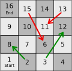

# What is Markov Chain?

A Markov Chain, also called Markov Process, is a stochastic (that is random) process, where the probability of the process transitioning to any state depends solely on the current state of the process. For the sake of simplicity, this discussion will be limited to discrete-time Markov Chains.

### Formal definition
Let $X_n, n=0,1,2,...$ be a  stochastic process that takes a countable number of possible values. Let these possible values be indexed by the set of integers \\(\left \\{ 1,2,3,... \right \\}\\). If $X_{n}=i$, the process is said to be in state \\(i\\) at time \\(n\\). When the process is in state \\(i\\), let there be a fixed probability \\(P_{ij}\\) that it will next be in state \\(j\\). Such a stochastic process is called a Markov Chain.

Probabilities are always non-negative and the process must make a transition at every increment in $t$ from current state $i$ in to some state $j$ (note, $j$ may or may not be equal to $i$). Hence we have:

$$ P_{ij} \geq 0, \hspace{1em} i,j \geq 0, \hspace{1em} \sum_{j=0}^\infty P_{ij} = 1 $$

### What does it mean in plain English?
A Markov Chain is a stochastic process such that:
- At any given time, the process is in some state.
- All the states that the process can assume are known.
- The total number of states that the process can assume is either a finite number or countably infinite.
- At every unit increment in time, the process transitions from its current state to some state. The new state may or may not be the same as the current state.
- For every possible state $i$, the probability of transitioning to every possible state is fixed and defined; and adds up to \\(1\\).
- That's it.

### One-step transition probability matrix
As mentioned above, for every possible state $i$, the probability of transitioning to every possible state is fixed and defined. These probability values can be put in to a matrix form for ease of mathematical manipulation, and this matrix is called one-step transition probability matrix &mdash; because, it is the probability matrix for a single time-step. It fully defines the given Markov process. The matrix is defined as follows:

$$ \textbf{P} = \begin{pmatrix}
 &P_{00}  &P_{01}  &P_{02}  &... \\
 &P_{10}  &P_{11}  &P_{12}  &... \\
 &\vdots  &\vdots  &\vdots \\
 &P_{i0}  &P_{i1}  &P_{i2}  &... \\
 &\vdots  &\vdots  &\vdots \\
\end{pmatrix}
$$

### An example: Snakes and ladders
Let's consider a board of size 4 x 4, and a simplified scenario where a single player throws dice and moves the piece by the number thrown up. The game starts with the piece placed on the cell numbered one. The cell number represents the state of the process. This process is a Markov chain because,
- At any given time, the process is in some state, the initial state being \\(X_0 = 1\\).
- All the states that the process can assume are known: \\(\left \\{ 1,2,3,...,15,16 \right \\}\\)
- Obviouly, the total number of states that the process can assume is finite.
- A dice throw represents a unit increment in time, and at every dice throw, the process transitions from its current state to some state.
- For every possible state $i$, the probability of transitioning to every possible state is fixed and defined; and adds up to \\(1\\).

Let's evaluate the probabilities of transitioning to all possible states when \\(X_0 = 1\\), and when \\(X_k = 12\\). In any case, always, the dice throws up the numbers 1 to 6 with equal probability of \\(\frac{1}{6}\\).
- When \\(X_0 = 1\\), when the dice throws 1, 2, 3, 4, 5, or 6; the piece will move to 8 (via 2), 12 (via 3), 4, 5, 6, and 7 respectively. Hence $P_{1,8} = P_{1,12} = P_{1,4} = P_{1,5} = P_{1,6} = P_{1,7} = \frac{1}{6}$. Probability of transition to all other states is 0.
- When \\(X_k = 12\\), when the dice throws 1, 2, 3, 4, 5, or 6; the piece will move to 11 (via 13), 14, 6 (via 15), 16, 12, and 12 respectively - because the piece cannot move when the dice throws 5 or 6. Hence $P_{12,11} = P_{12,14} = P_{12,6} = P_{12,16} = \frac{1}{6}$; and $P_{12,12} = \frac{2}{6}$. Probability of transition to all other states is 0.
- Also note that, once the piece reaches the state 16 it remains there forever, no matter what number the dice throws up. Hence $P_{16,16} = 1$. Probability of transition to all other states is 0.

